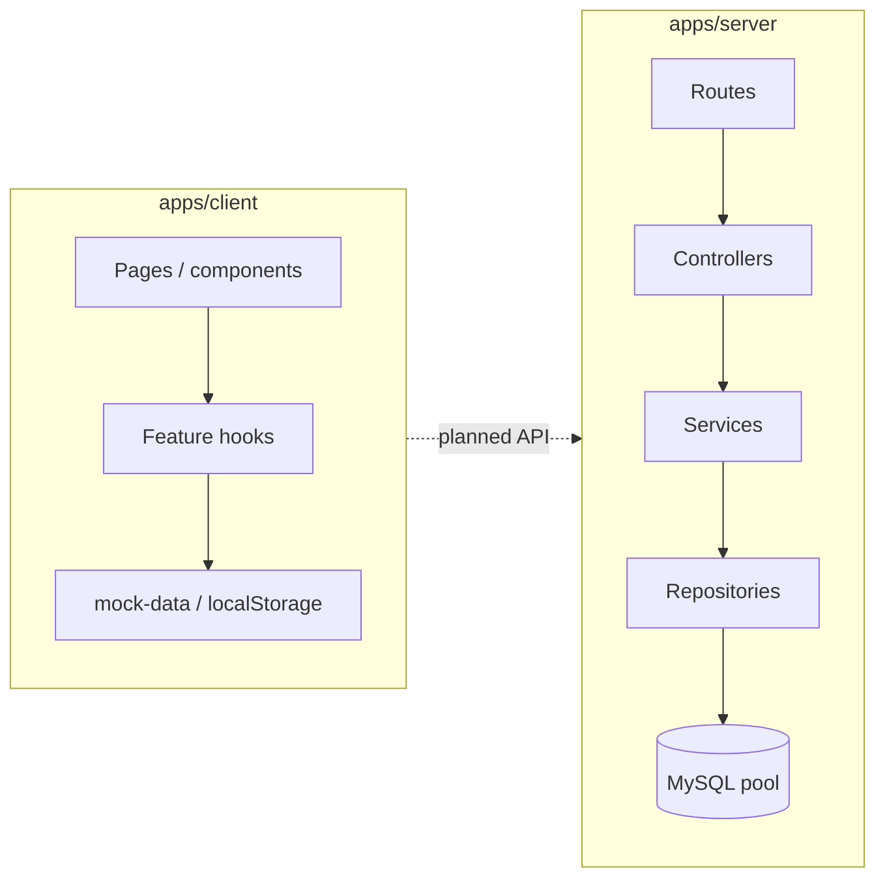

# Backend RBAC, constraints, and frontend alignment

This document describes **how roles work on the server**, **engineering constraints**, **how that compares to the current client**, whether **integration is feasible**, and **what is missing**. It follows a **KISS** mindset: document reality first, avoid speculative frameworks.

---

## 1. Backend user roles (effective RBAC)

Roles are **strings** stored in MySQL (`roles.name`), joined to users as `role_name` at login and embedded in the JWT as `role`. Route guards use **`authorize('roleA', 'roleB')`** after **`authenticate`**.

### 1.1 Roles referenced in route code

| Role | Where it appears |
|------|------------------|
| **`admin`** | Broad write access: parents, fee structures/payments, teachers, subjects (create/delete/assign), student delete, auth user listing |
| **`manager`** | Classes (update/delete/migrate), subjects (`PUT`) |
| **`teacher`** | Students (`POST`/`PUT`), fee payment recording (`POST /pay`) |
| **`user`** | Classes **`POST /create`** only (with admin and manager) |

### 1.2 Roles implied by the frontend types (no `user`)

The client enum in `apps/client/lib/types.ts` includes **`admin`**, **`manager`**, **`teacher`**, **`student`** — **not** **`user`**.

If the database defines a `user` role for “can create a class only”, the UI never models that role explicitly today. Integration must either **map `user` → UI behavior** or **narrow backend roles** to match product language.

### 1.3 Effective permission matrix (HTTP surface)

Legend: **Auth** = any valid JWT; **Admin** = `admin`; unless noted, **GET** on a module requires Auth only.

| Area | Read | Create / update | Delete / destructive |
|------|------|-----------------|----------------------|
| **Auth** | `/login`, `/register` public; `/me`, `/change-password` Auth | — | — |
| **Auth users list** | **`GET /users`** → Admin only | — | — |
| **Parents** | Auth | Admin | Admin |
| **Fees** | Auth (structures, ledger, payments) | Structures / assign classes → Admin; **record payment** → Admin **or** Teacher | Payment delete/update → Admin |
| **Teachers** | Auth | Admin writes | Admin |
| **Subjects** | Auth | Admin create; **`PUT`** Admin **or** Manager | Admin |
| **Classes** | Auth | **`POST /create`** Admin, Manager, **User** | Update/delete/migrate → Admin or Manager |
| **Students** | Auth | Admin **or** Teacher | **Admin only** |

### 1.4 Constraints (things the backend assumes)

1. **JWT** carries `sub`, `name`, `email`, `role` — server trusts **`role`** from the token until expiry; changing a user’s role in DB does not revoke old tokens early (no refresh/blacklist in current code).
2. **Teacher scope** on students is **not** enforced in a dedicated middleware: **any authenticated teacher** may **`POST`/`PUT` students** on routes that allow teacher — finer “only my classes” rules belong in **service/repository** layers if required by policy.
3. **Parents** exist as a full API module on the server; there is **no** equivalent dashboard section in the client route list (parents are not a first-class UI feature yet).
4. **`student`** role exists in the frontend model for future student portals; backend routes tested above mostly require **Auth** for reads — **product rules** should clarify what a student token may call (avoid exposing full lists accidentally).

---

## 2. Practices for maintainability and scalability (KISS)

### 2.1 What the codebase already does well

- **Modular routes** per domain (`parents`, `fees`, `teachers`, …) with a consistent **route → controller → service → repository** split — easy to navigate and test incrementally.
- **Central errors** (`error.middleware`) and **validation helper** (`validate.middleware`) reduce duplication.
- **Connection pooling** (`mysql2` pool, limit 10) is appropriate for a single Node process serving a school-sized workload.

### 2.2 Reasonable next steps (without over-engineering)

| Concern | Lightweight direction |
|---------|------------------------|
| **Consistency** | Enforce teacher/student scoping in **services** (single place per use case), not scattered in controllers. |
| **Operational scale** | Horizontal scale = **stateless API** + shared DB + sticky JWT secret; add **read replicas** only if metrics justify it. |
| **Observability** | Structured logs + request id (small middleware) before adopting full APM. |
| **Security** | Prefer **HTTP-only cookies** for tokens when integrating the browser client; keep Helmet/CORS aligned with deployment URL. |

### 2.3 What to avoid early

- Splitting into microservices before traffic or team boundaries require it.
- Duplicating RBAC in both client and server without a **written matrix** (this doc is that baseline for the server).

---

## 3. Architecture snapshot

**Verdict for Sukuu-Mu’s stated features (school admin, classes, fees, attendance UX on client):**  
A **monolithic Express API + MySQL** is **efficient enough** and **appropriate** if traffic is institutional (not massive concurrent public traffic). The **bigger gap** today is **feature parity** (attendance, auth transport, parents UI) and **policy clarity** (teacher scope), not the high-level architecture pattern.

---

## 4. Frontend vs backend: alignment

### 4.1 Integration possible?

**Yes.** The server exposes stable **`/api/v1`** JSON endpoints and JWT auth; the client already separates **hooks**, **permissions**, and **types**. The work is **mechanical but deliberate**: API client, token storage, and mapping backend DTOs (e.g. `name` vs `firstName`/`lastName`) — not a rewrite.

### 4.2 Current mismatches (must address during integration)

| Topic | Frontend today | Backend today |
|-------|------------------|---------------|
| **Auth** | Mock users + `localStorage` user JSON | `POST /auth/login` → JWT; `Bearer` on routes |
| **User shape** | `firstName`, `lastName` | User records use **`name`** (single field in auth flows) |
| **Data** | Hooks mutate **mock** arrays | REST + MySQL |
| **Role `user`** | Not in `UserRole` enum | Used on **class create** |
| **Attendance** | `use-attendance`, dashboard page | **No** `/api/v1/attendance` module |
| **Parents** | No dashboard routes observed | Full **`/api/v1/parents`** API |
| **Teacher finance visibility** | `canViewFinances` allows teacher for “their” students (mock graph) | Fee **reads** are Auth-wide — **policy** must be tightened if teachers should not see all ledgers |
| **Payment recording** | `canRecordPayment` → Admin/Manager only | Backend allows **Admin or Teacher** for **`POST .../pay`** |

### 4.3 Missing or ambiguous endpoints (for checkout)

**Clearly missing for current UI:**

- **Attendance**: CRUD + query by class/date/student (whatever the product agrees on).

**Backend exists, client UI thin or absent:**

- **Parents** API — decide product scope (guardian portal vs admin-only CRUD).

**Policy / contract gaps (not always “new routes”):**

- Align **fee visibility** and **payment permissions** with `permissions.ts` and real school rules.
- Decide **`student`** role API surface (dashboard currently shows **Students** to everyone authenticated — backend allows any Auth user to list students).

---

## 5. KISS integration checklist (when you proceed)

1. **`apps/client/lib/api`** — thin `fetch` wrappers per domain (auth, students, …); one place for `baseURL` and `Authorization`.
2. **Keep hooks** — swap internals from mock state to API calls; preserve component APIs where possible.
3. **Map user DTO** — normalize `name` ↔ `firstName`/`lastName` in one adapter (or evolve backend to split fields if product insists).
4. **Single RBAC doc** — treat **section 1** of this file plus **`permissions.ts`** as the checklist; update both when behavior changes.
5. Add **attendance** only after agreeing minimal schema + endpoints (avoid speculative extras).

---

## 6. Critical thinking questions (avoid ad hoc work)

Use these before coding integration or new endpoints:

1. **Who may see a full student list?** Should teachers see all students or only those in assigned classes — and where is that enforced (service layer vs new query params)?
2. **Who may see fees?** Same question for ledgers and payments; should reads be scoped by `student_id` and membership?
3. **Attendance rules:** One roll call per class per day? Late edits? Who can edit after submission?
4. **Identifiers:** Are IDs numeric (MySQL) or string UUIDs in the client? Pick one strategy for URLs and state.
5. **Token lifecycle:** Access-only JWT vs refresh; logout behavior; role changes vs outstanding tokens.
6. **`user` role:** Is it a real persona (e.g. class rep) or legacy? Should the dashboard reflect it?
7. **Parents:** Admin-only data entry vs parent self-service login — different endpoints and RBAC.
8. **Pagination:** Will student/class lists grow enough that `GET /` without pagination hurts? When to add `limit`/`cursor`?
9. **Validation parity:** Which fields are required on create/update on server vs what forms send — avoid silent 422s.
10. **Environment:** Single deployment origin for client + API — CORS and cookie settings agreed?

---

## Related docs

- **`docs/architecture/production-roadmap.md`** — phased path to production and scale (startup-appropriate)  
- `docs/frontend/auth-and-roles.md` — current mock auth and planned evolution  
- `docs/frontend/state-and-data.md` — hooks and planned API layer  
- `apps/server/README.md` — env vars and route overview  
